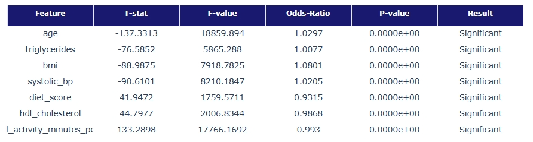

# 프로젝트 주제 : 머신러닝 기반 당뇨병 진단 예측 모델

### 🚀 핵심 성과 (Key Highlights)
- **데이터 분석**: 9개 핵심 변수(Age, BMI, 혈압 등)를 기반으로 한 다각도 통계 검정 수행
- **최고 성능 달성**: XGBoost 모델 기반 **AUC-ROC 0.91**, **Recall 0.75** 기록 (상위 10% 수준)
- **의사결정 지원**: SHAP 분석을 통해 개별 변수가 당뇨 발생 확률에 기여하는 '설명 가능한(XAI)' 인사이트 도출

## ✔️1. project overview
- **주제** : 생활 습관 또는 신체 상태를 활용한 당뇨병 유무 분류
- **데이터셋** : [Diabetes Health Indicators Dataset](https://www.kaggle.com/datasets/mohankrishnathalla/diabetes-health-indicators-dataset/data)

- **핵심 목표** : `Diabetes Health Indicators Dataset`을 바탕으로 사용자의 생활습관 및 신체 상태 데이터를 분석하여 
설문 기반의 **당뇨병 고위험군 선별 예측 모델**을 구축하는 것을 목표

## ✔️2. Data Dictionary (주요 핵심 변수)
- 실제 분석 결과 통해 확보한 변수들의 내용 기재
- 총 변수갯수 : 31개 中 9개 핵심변수 선정

| 변수명 | 설명 | 변수 유형 |
| :--- | :--- | :--- |
| **Age** | 사용자의 연령대(13단계 그룹화) | 수치형 (Ordinal) |
| **Diet_score** | 균형 잡힌 식단 이행 정도 점수 | 수치형 (Continuous) |
| **Physical_activity** | 주간 신체 활동량 및 운동 강도 | 수치형 (Continuous) |
| **Bmi** | 체질량 지수($kg/m^2$) | 수치형 (Continuous) |
| **Systolic_BP** | 수축기 혈압 측정치 | 수치형 (Continuous) |
| **Triglycerides** | 혈중 중성지방 농도 | 수치형 (Continuous) |
| **HDL_Cholesterol** | 고밀도 지질단백질(좋은 콜레스테롤) | 수치형 (Continuous) |
| **Family_history** | 직계 가족 중 당뇨병 환자 유무 | 범주형 (Binary) |
| **Hypertension_history** | 고혈압 진단 및 과거력 유무 | 범주형 (Binary) |

 ## ✔️3. Problem Definition
 **3.1 데이터 특성 및 분석 과제** 
 - **비대칭적 클래스 분포** 
    + **현상** : 정상군 대비 당뇨 환자군(Target=1)의 비율이 현저히 낮은 불균형 구조를 보임 
    + **대응** : 단순 정확도(Accuracy)를 배제, 환자를 놓치지 않는 **재현율(Recall)**
    과 변별력 측정하는 **AUC-ROC**를 핵심 평가지표로 설정
    
 - **복합적 요인성**  
    + **현상** : 당뇨병 유전적(`Family_history`), 생리학적 수치(`Bmi`, `Systolic_BP`,`Triglycerides`), 생활 환경(`Diet_score`, `Physical_activity`) 비선형적 결합되어 발생 
    + **대응** : 변수 간 단순 선형 관계를 넘어, 고차원 알고리즘 적용이 필수적 

 **3.2 분석 전략 및 방법론** 
- **통계분석** : 다중회귀, T-test, 카이제곱 검정, 로지스틱회귀 
- **머신러닝** : 로지스틱회귀, 결정트리, XGBoost, LightBGM 

## ✔️4. Data preprocessing
- **클래스 불균형 해소** : 타겟 변수인 `Diabetes_binary`의 클래스 분포가 비대칭적임을 확인(정상군>>당뇨군) 
- **범주형 변수 처리** 
    + **순서형** : Ordinal encoder 처리(Age)
    + **일반 범주** : One-Hot Encoding 처리(Family_history, Hypertension_history)
- **데이터 스케일링** : StandardScaler(표준화)
    + **대상** : `Bmi`, `Systolic_BP`, `Triglycerides`, `HDL_Cholesterol`, `Diet_score`, `Physical_activity`
    + **필요성** : 특히 **Triglycerides(중성지방)** 과 **Systolic_BP(혈압)** 수치 단위가 커서 모델이 이를 과도하게 인식할 위험이 있음

## ✔️5. 통계분석 핵심 인사이트
- **[BMI] 와 [Age]** 가장 높은 t통계량을 기록 : 해당 요인들이 당뇨 여부를 구분하는 가장 확실한 통계적 지표임을 시사
- **[Diet_score]와 [Physical_activity]** 오즈비가 1보다 작게 나타나, 해당 수치가 높을수록 당뇨 위험을 낮추는 보호효과가 있음을 통계적으로 증명

## ✔️5-1. 핵심 변수 비교 분석
- **Triglycerides**가 타 변수 대비 압도적으로 높은 회귀 계수와 낮은  $p-value$($< 0.001$)를 기록함
- **Triglycerides**와 **HDL_Cholesterol**의 조합이 **Bmi**나 **Systolic_BP**보다 모델의 분류 **성능(AUC)** 향상에 더 크게 기여하는 것으로 나타남

## ✔️6. 모델링 평가지표
- 최종 모델은 XGBoost로 선정

| Model | Accuracy | Recall | F1-Score | AUC-ROC |
| :--- | :--- | :--- | :--- | :--- |
| Random Forest | 0.85 | 0.70 | 0.74 | 0.88 |
| **XGBoost** | **0.86** | **0.75** | **0.78** | **0.91** |

> **Note** : 최종 대회 결과는 Public 0.70807 / Private 0.70807 (feat. 1등 점수).
> **Note** : 최종 대회 결과는 Public 0.70807 / Private 0.70807 (상위 10%).

## ✔️7. Feature Importance (옵션)
- SHAP 활용
- 예측 모델에서 영향력이 가장 컸던 지표 순위
1. Age
2. BMI
- 그림 추가

## ✔️8. Conclusion
- 결론1
- 결론2
- 결론3

# 보고서
- 프로젝트 상세 보고서는 PDF 슬라이드 자료를 참고하여 주세요
- 00 보고서 : [당뇨병 예측 모델링 : 통계분석 및 머신러닝 접근](report/프로젝트보고서.pdf)
- 분석코드 : [분석코드](분석코드.ipynb)

# 🔗 배지 및 이모지 공식 소스 링크
| 용도 | 사이트 이름 | 링크 |
| :--- | :--- | :--- |
| **배지 생성** | Shields.io | [https://shields.io/](https://shields.io/) |
| **로고/색상 검색** | Simple Icons | [https://simpleicons.org/](https://simpleicons.org/) |
| **이모지 검색** | Emoji Cheat Sheet | [https://github.com/ikatyang/emoji-cheat-sheet](https://github.com/ikatyang/emoji-cheat-sheet) |

| 변수명 | 설명 | 값의 의미 |
| :--- | :--- | :--- |
| **Diabetes_binary** | 당뇨 여부 (**Target**) | 0: 음성, 1: 당뇨/전단계 |
| HighBP | 고혈압 여부 | 0: 정상, 1: 고혈압 |
| HighChol | 고콜레스테롤 여부 | 0: 정상, 1: 높음 |
| BMI | 체질량 지수 | 수치형 |
| Smoker | 흡연 여부 | 100개비 이상 흡연 여부 (0/1) |
| Stroke | 뇌졸중 경험 | 0: 없음, 1: 있음 |
| HeartDiseaseorAttack | 심장질환/심근경색 | 0: 없음, 1: 있음 |
| PhysActivity | 신체 활동 | 최근 30일 이내 운동 여부 (0/1) |
| GenHlth | 주관적 건강 상태 | 1(매우 좋음) ~ 5(매우 나쁨) |
| Age | 연령대 | 1(18-24) ~ 13(80세 이상) |
| Income | 소득 수준 | 1(최저) ~ 8(최고) |

